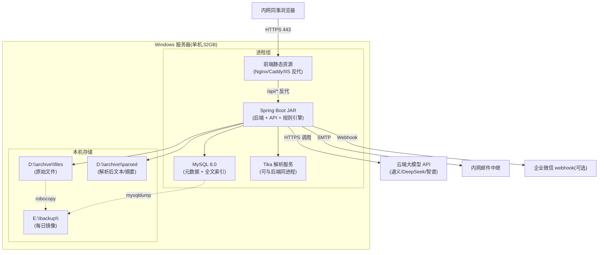
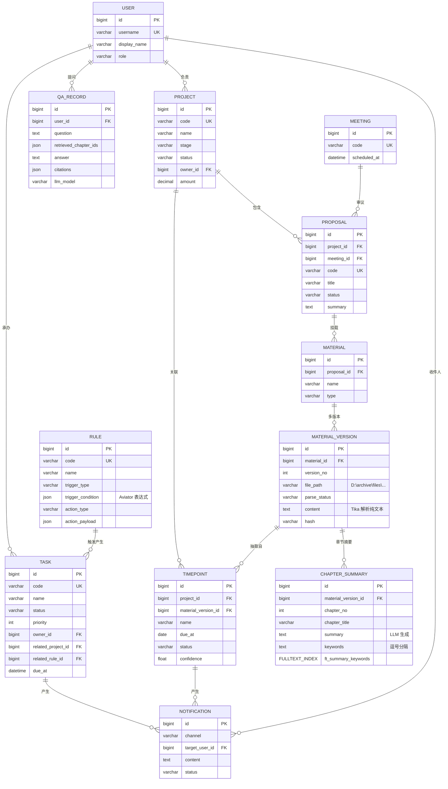

# 投委会档案管理系统 — 轻量架构方案(单机单人版)

> 适用于:**Windows 单机服务器(32GB 内存,CPU 不强)+ 单人开发(我)+ 内网同事浏览器访问**
> 文档库规模:≤ 50GB 原始文件
> 部署哲学:**能少一个组件就少一个,所有进程都跑在一台 Windows 上,不搞容器不搞高可用**
> 文档基线:2026-06,基于你的实际硬件和人员约束重做

---

## 0. 一句话总览

**MySQL 8 + Spring Boot 3 单体 + Vue 3 + 本地文件夹存文件 + WinSW 包成 Windows 服务 + 大模型走云端 API + 知识库用"全文检索 + 章节摘要 + LLM 总结"不搭向量库**。

总共 3-4 个进程(JAR 后端 + 前端静态 + MySQL + 可选 OCR),开发 2-3 个月边干边迭代,不画甘特图。

---

## 1. 关键约束(你说的)

| 约束 | 设计影响 |
|---|---|
| Windows 单机,32GB 内存,CPU 不强 | **不上 Ollama/本地 LLM**,走云端 API;**不搭向量库**(Qdrant/Milvus) |
| 没有 PostgreSQL,只有 MySQL | 沿用 MySQL,**不强推 PG**;MySQL 8.0+ 全文索引够用 |
| 不招人,我一个人写 | 不搞 K8s/Docker/容器编排;**不搞前后端分离微服务**;单体 JAR 即可 |
| 没运维 | **不搞高可用双机热备**;每天 mysqldump + 文件夹同步到另一块盘就够 |
| 文档 ≤ 50GB | 不需要对象存储 MinIO,直接 Windows 文件夹;不需 ES 集群,MySQL FULLTEXT 即可 |
| 同事浏览器访问 | 部署在内网,Windows IIS 或 Caddy 反代,**不暴露公网** |

---

## 2. 系统架构(单机版)

### 2.1 架构图



### 2.2 进程清单(总 3-4 个)

| 进程 | 占用 | 用途 | 服务化 |
|---|---|---|---|
| **后端 JAR** | 1-2 GB | Spring Boot 3 + Tika 嵌入 + Aviator 规则 | WinSW |
| **前端静态**(Nginx 或 Caddy) | < 100 MB | Vue 3 打包后 dist + 反向代理 | WinSW |
| **MySQL 8.0** | 2-4 GB | 元数据 + 全文索引 + 任务状态 | Windows 服务 |
| (可选)**Tesseract OCR** | 临时进程 | 扫描件 PDF/图片识别 | 由后端调用 |

> **不跑**:Docker / K8s / Qdrant / OpenSearch / MinIO / Ollama / 独立 Tika 服务 / XXL-JOB / Prometheus + Grafana(改用 Windows 性能计数器 + 计划任务告警)

---

## 3. 技术选型(精简)

### 3.1 完整选型表

| # | 组件 | 选型 | 为什么不选其他 |
|---|------|------|---------------|
| 1 | **前端** | **Vue 3 + Vite + TypeScript + Element Plus** | 生态熟,一个人写,组件库省事 |
| 2 | **后端** | **Java 17 + Spring Boot 3.3** | 金融/政企通用栈,Tika/Drools/Aviator 都在 Java 生态;Swagger/Actuator 现成 |
| 3 | **数据库** | **MySQL 8.0**(用你已有的) | 已有就用;8.0 FULLTEXT 索引 + JSON 字段够用,不强推 PG |
| 4 | **文件存储** | **Windows 本地文件夹**(D:\archive\files) | 50GB 不大,本地最快;后续可挂 NAS |
| 5 | **文档解析** | **Apache Tika 2.9**(嵌入后端进程) | 一站式 PDF/Word/Excel/PPT,Apache 2.0,免独立部署 |
| 6 | **OCR** | **Tesseract 5 + chi_sim**(独立可执行) | 轻量、纯 CPU、Apache 2.0,Windows 原生包;不需要 PaddleOCR 的 GPU |
| 7 | **知识库** | **不搭向量库** — 用 MySQL FULLTEXT + 章节摘要 + LLM 总结 | 50GB 文档,关键词 + 全文检索 + LLM 改写已经够用;向量库收益不抵运维成本 |
| 8 | **任务调度** | **Spring @Scheduled + ShedLock** | 不要 XXL-JOB 这种分布式调度,1 台机用不上 |
| 9 | **消息通知** | **SMTP 邮件(主)+ 企业微信 Webhook(选)** | SMTP 内网通;企业微信可选,Webhook 一句话 POST |
| 10 | **大模型** | **云端 API**(通义千问 / DeepSeek / 智谱) | 不上 Ollama;CPU 不强;按 token 计费,50GB 文档量小,成本可控 |
| 11 | **规则引擎(5 号需求)** | **Aviator 5.x**(Java 表达式引擎) | Drools 太重,Aviator 几行 Java 表达式即可;规则 < 50 条够用 |
| 12 | **反代/HTTPS** | **Caddy 2**(Windows 单 exe) | 自动 HTTPS,可绑定内网 CA;IIS ARR 也行但啰嗦 |
| 13 | **Windows 服务化** | **WinSW 3.x** | JAR → Windows 服务,onfailure=restart,开机自启 |

### 3.2 选型逻辑(为什么"不搭")

- **不搭向量库**:50GB 文档,粗估 100 万-200 万 chunk;向量检索收益:跨段落语义检索。50GB 文档主要是合同/纪要,关键词 + 章节定位已经够;真要做语义检索,Qdrant 单机也只要 200MB 内存,但要新组件、新备份、新监控。**先用 MySQL FULLTEXT + LLM 总结跑通,真不够再加 Qdrant**(成本几百元 + 半天集成)。
- **不搭对象存储 MinIO**:50GB 直接 D:\archive\files 即可,后端写文件路径到 MySQL。要扩展 NAS/对象存储是后话。
- **不搭 OpenSearch/ES**:MySQL 8 FULLTEXT 中文需要 ngram 解析器(我下面会讲);百万行量级够用。
- **不上 Docker/容器**:你一个人写,装 Docker 本身就要半天配置;JAR + WinSW 部署更快更可调试。
- **不上本地 LLM**:32GB 内存跑 14B 量化勉强但慢;CPU 不强更不行;云端 API 一秒返回,按 token 计费 50GB 文档一次性建库也就几十块。
- **不搞分布式**:单机 + 每日 mysqldump + robocopy 同步到 E 盘,这就是"穷人版灾备",对 50GB 数据足够。

---

## 4. 知识库方案(本系统的"重头戏"简化)

### 4.1 不搭向量库的检索流程


**MySQL 中文全文检索的关键**:
- 8.0 内置 ngram 解析器,无需额外插件
- 建表时:`FULLTEXT INDEX ft_title_content (title, content) WITH PARSER ngram`
- 查询:`MATCH(title, content) AGAINST('合同付款条款' IN BOOLEAN MODE)`

### 4.2 摘要生成(冷启动时跑一次)

每份材料入库时:
1. Tika 解析 → 纯文本
2. 切分章节(正则识别"第 N 条"、"1."、"##"等)
3. 每章节用 LLM 生成 200 字摘要 + 3-5 个关键词 → 入 MySQL(`chapter_summary` 表)
4. 索引建立:fk + 章节路径 + 摘要 FULLTEXT 索引

### 4.3 评估集与质量门禁

- 业务方/你本人标 30-50 条"问题 + 期望答案 + 引用段落"(一人开发不要 300-500 条,30 条够起步)
- 每次 prompt/模型变更重跑,目标:**top-5 召回率 ≥ 80%**、**答案可用率 ≥ 70%**、**P95 端到端 ≤ 4s**

---

## 5. 数据模型(精简版)

沿用之前 14 个实体的思路,但**砍掉不必要的**:



**对比上一版砍掉了**:
- KBChunk(用 CHAPTER_SUMMARY 代替,不做向量)
- FileObject(简化掉,文件路径直接存在 MATERIAL_VERSION.file_path)
- Role 简化为 USER.role 字符串(单人开发,权限简化)

---

## 6. 节点触发(5 号需求)—— 轻量方案

不搞 Drools 那种重规则引擎。用 **Aviator 5.x**(Java 表达式引擎,几 MB),规则存 MySQL JSON 字段。

**规则示例(收款凭证 → 平往来款)**:

```json
{
  "trigger": "material.uploaded",
  "condition": "material.type == 'receipt' && material.amount > 0",
  "action": "create_task",
  "task_template": {
    "name": "平往来款:${material.project_code}",
    "owner_role": "finance",
    "due_days": 3
  }
}
```

**执行流程**:
1. 材料上传完成 → Spring `ApplicationEventPublisher` 发布 `MaterialUploadedEvent`
2. `@EventListener` 接收 → 加载所有 enabled 规则 → Aviator 表达式求值
3. 命中 → 创建 Task 记录 → (可选)发邮件
4. 全程异步,慢也不影响主流程

> 后续如果规则变复杂(> 50 条、需要拖拽编辑),再考虑 Drools;但先不预判。

---

## 7. 时点提取(4 号需求)—— 简化

两种来源:
1. **手工设置**:用户在前端"项目详情 → 时点"页面直接添加
2. **自动抽取(可选)**:上传材料后,后端用 LLM 提取"截止日期/到期日"等时点 → 写入 TIMEPOINT(置信度 < 0.8 标"待人工复核")

**提醒**:
- 每天凌晨 02:00 跑 `@Scheduled` 任务,扫描未来 30/7/1/0 天的时点
- 命中 → 写 NOTIFICATION 记录 + 发邮件(或企业微信 webhook)

---

## 8. Windows 单机部署

### 8.1 目录结构

```
D:\archive\
├── files\                    # 原始文件
│   ├── 2024\
│   │   ├── PRJ001-001-v1-尽调报告.pdf
│   │   └── ...
├── parsed\                   # 解析后纯文本(可选,节省重复解析)
│   └── ...
└── logs\                     # 应用日志

E:\backup\                    # 每日镜像(独立盘,防单盘坏)
├── mysql\                    # mysqldump 输出
└── files\                    # robocopy 同步

D:\apps\
├── mysql-8.0\               # MySQL 安装目录
├── jdk-17\                  # JDK
├── backend\
│   ├── archive.jar          # Spring Boot 打包
│   ├── application.yml
│   └── logs\
├── frontend\                # Vue dist 静态文件
├── caddy\                   # Caddy 反代
│   ├── caddy.exe
│   ├── Caddyfile
│   └── certs\
└── winsw\                   # WinSW 工具
    ├── backend.xml
    ├── caddy.xml
    └── ...
```

### 8.2 进程管理(WinSW 配置文件)

**backend.xml**:
```xml
<service>
  <id>archive-backend</id>
  <name>投委会档案 - 后端</name>
  <executable>java</executable>
  <arguments>-jar -Xms512m -Xmx1536m -Dfile.encoding=UTF-8 -Dconsole.encoding=UTF-8 "D:\apps\backend\archive.jar" --spring.config.location="D:\apps\backend\application.yml"</arguments>
  <workingdirectory>D:\apps\backend</workingdirectory>
  <log mode="roll-by-size">
    <sizeThreshold>10240</sizeThreshold>
    <keepFiles>10</keepFiles>
  </log>
  <onfailure action="restart" delay="30 sec"/>
  <resetfailure>1 hour</resetfailure>
</service>
```

注册为服务:`backend.exe install` → Windows 服务管理器里启动 → 设置"自动启动"

### 8.3 反向代理(Caddyfile)

```caddyfile
# D:\apps\caddy\Caddyfile
:443 {
    encode zstd gzip
    reverse_proxy localhost:8080
    handle /assets/* {
        root * D:\apps\frontend
        file_server
    }
    handle /* {
        root * D:\apps\frontend
        try_files {path} /index.html
        file_server
    }
}
```

后端跑在 8080,Caddy 443 反代。前端用 history 模式(Caddyfile 已配 try_files)。

### 8.4 备份(每日计划任务)

**1. MySQL 备份**(每天 02:00):
```bat
@echo off
set ts=%date:~0,4%%date:~5,2%%date:~8,2%
"E:\backup\mysql\backup-%ts%.sql"
mysqldump -u root -pYOURPASSWORD archive_db | gzip > "E:\backup\mysql\backup-%ts%.sql.gz"
forfiles /p "E:\backup\mysql" /m *.sql.gz /d -30 /c "cmd /c del @path" 2>nul
```

**2. 文件夹同步**(每天 03:00):
```bat
robocopy "D:\archive\files" "E:\backup\files" /MIR /Z /R:3 /W:10 /LOG:"D:\archive\logs\robocopy.log"
```

**3. 上传 OCR 失败/异常文件单独告警**(邮件):
```powershell
# 扫描 logs 目录最近 24h ERROR
Get-Content "D:\archive\logs\backend.log" | Select-String "ERROR" | Where-Object { $_ -match (Get-Date).AddDays(-1).ToString() } | Out-File "D:\archive\logs\errors-today.log"
if ((Get-Item "D:\archive\logs\errors-today.log").Length -gt 0) {
    Send-MailMessage -To "you@example.com" -From "archive@example.com" -Subject "[Archive] 异常告警" -Body (Get-Content "D:\archive\logs\errors-today.log" | Out-String) -SmtpServer "smtp.internal"
}
```

**Windows 计划任务** 把这三个脚本串起来。

### 8.5 监控(穷人版)

- **磁盘空间**:每天 PowerShell 扫一下,低于 10% 邮件告警
- **MySQL 连接**:Spring Boot Actuator `/actuator/health` 暴露,Caddy 之外再加一个 cron curl,失败发邮件
- **JAR 进程**:WinSW 自带 `onfailure=restart`,崩了自动拉起
- **不需要**:Prometheus + Grafana(过度)

---

## 9. 实施排期(单人版)

不画甘特图,按**模块顺序**逐个上,每个模块做到能 demo 就停。

| 阶段 | 内容 | 预估工时 | 你能 demo 什么 |
|---|---|---|---|
| **M0 基建** | JDK 17 + MySQL 8 + WinSW + Spring Boot 工程脚手架 + Vue 3 工程 + 用户/角色 + 登录 + Caddy 反代 | 3-5 天 | 打开浏览器能看到登录页,登录后看到空框架 |
| **M1 档案 CRUD** | 项目/议案/材料 3 张表 + 上传下载 + 版本管理 + Tika 解析入库 | 5-7 天 | 上传一份 PDF,看到解析出的纯文本存到了 MySQL |
| **M2 知识库** | 章节切分 + 摘要生成(LLM) + MySQL FULLTEXT 索引 + 问答 UI | 5-7 天 | 上传 5 份合同,问"XX 项目的付款条款",能看到带引用的答案 |
| **M3 时点与日程** | 时点手工录入 + LLM 自动抽取(可选) + 提醒任务 + 邮件 | 3-5 天 | 创建一个项目,加几个时点,前 1 天自动收到邮件 |
| **M4 规则引擎** | Aviator 表达式 + 事件订阅 + 任务生成 + 试运行 | 5-7 天 | 配置"收到款凭证 → 平往来款任务",上传凭证,自动生成任务 |
| **M5 打磨上线** | 操作审计 + 灰度(对你就是"先自己用 1 周")+ 培训文档 + 备份演练 | 3-5 天 | 全流程跑通,文档齐,IT 接手 |

**总工时:25-35 个工作日,按每天 6-8 小时有效编码 ≈ 4-6 周**

> 这是一个"边做边调整"的节奏,不是大项目计划;每个模块独立可交付,做不完就先上线能用的。

---

## 10. 成本估算(就你自己 + 一台机器)

| 项目 | 金额 | 备注 |
|---|---|---|
| 服务器(已有) | 0 | 你的 32GB Windows |
| MySQL(已有) | 0 | |
| 域名(可选) | ~80 元/年 | 内网域名 |
| SSL 证书(可选) | 0 | 自签 / mkcert |
| 大模型 API | **~50-300 元/月** | 50GB 一次性建库 + 日常问答;按 token 计费 |
| 企业微信 webhook(可选) | 0 | 用现有企业微信 |
| 短信(可选) | ~30 元/月 | 仅最关键时点 |
| **总月成本** | **~50-300 元** | |

---

## 11. 风险与缓解(本方案特有)

| 风险 | 缓解 |
|---|---|
| CPU 不强,大批量上传会卡 | 后台异步队列,上传后立即返回"解析中",解析完发邮件通知 |
| 大模型 API 出网被合规拦 | 走**脱敏后调用**:客户名/项目名替换为代号,云端只看到代号 |
| MySQL FULLTEXT 中文不准 | 配合 LLM 二次重排序,关键词搜出 top 20,LLM 选 top 5 |
| 32GB 内存紧张 | MySQL 限 2-4GB,JAR 限 1.5GB,留 20GB+ 给 OS 和文件系统缓存 |
| 50GB 文件逐渐增长 | 半年后视情况迁移到 NAS 或挂对象存储;本次先不上 |
| WinSW 进程偶尔挂 | onfailure=restart 30s 拉起;Actuator health 端点外部 ping 监控 |
| 你自己一个人维护,长期被绑死 | 写好文档(README + 运维手册 + Runbook),关键决策点要记录,后面招人/交接不至于完全重做 |

---

## 12. 待你确认的关键决策点(精简到 5 个)

| # | 决策点 | 默认假设 | 备选 |
|---|---|---|---|
| 1 | **大模型 API 选哪家**? | 通义千问(DashScope,中文好,1 元/百万 token) | DeepSeek(更便宜,中文也好) / 智谱 GLM / OpenAI |
| 2 | **大模型 API 走完全内网隔离吗**? | **是**,文档先脱敏再上送 | 允许原始文档上送(需合规审批) |
| 3 | **OCR 是否需要**? 50GB 里有扫描件吗 | **是**(Tesseract + 轻量后处理) | 纯文本 PDF 就不上 OCR |
| 4 | **企业微信 Webhook 通道是否启用**? | **是**(投委会常用) | 只用邮件 |
| 5 | **数据备份的"另一块盘"是哪个**? | 假定你有 E 盘(独立于 D 盘) | NAS / 共享文件夹 |

---

## 13. 我给你的下一步建议

按这个方案的节奏,**你只需要现在就拍板 1-2 个事**:
- **大模型 API 选哪家 + API key 给我**(不给我 key 也可以,你写代码时自己配)
- **现有 MySQL 是什么版本、库名叫什么、给我个能 CREATE DATABASE 权限的账号**

剩下的我开始干,**第一个里程碑就是 M0 基建**(3-5 天),做出来你能登录、能看空框架,我把跑起来的方法贴给你。

具体执行步骤:
1. 我先建工程脚手架(后端 Spring Boot 3 + 前端 Vue 3 + Docker 不上,直接 NVM/JDK 装好)
2. 给你一个 README 写明:"装 MySQL 8 → 跑 init.sql → 启动 backend.bat → 启动 caddy → 浏览器开 https://localhost"
3. 你确认能跑通,我就开始 M1(档案 CRUD)

---

> **结语**:这个方案严格匹配你"单机、单人、文档量小、不想搭太重"的所有约束。**不堆组件、不上分布式、关键是先把 5 个需求跑通**,后续真有性能问题再升级(扩到 2 台机 / 加向量库 / 接更大模型),都比一开始就搭大再拆省事。
