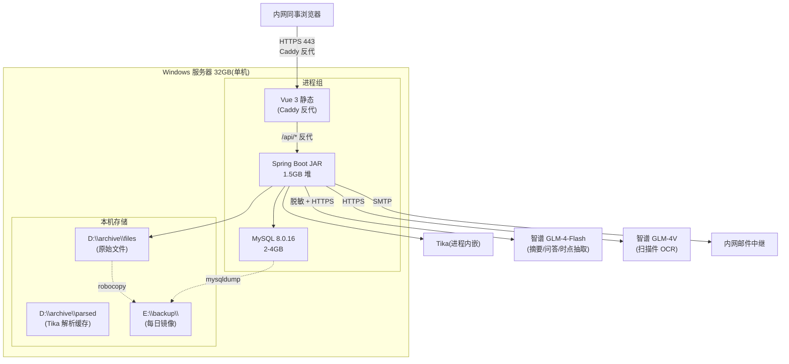
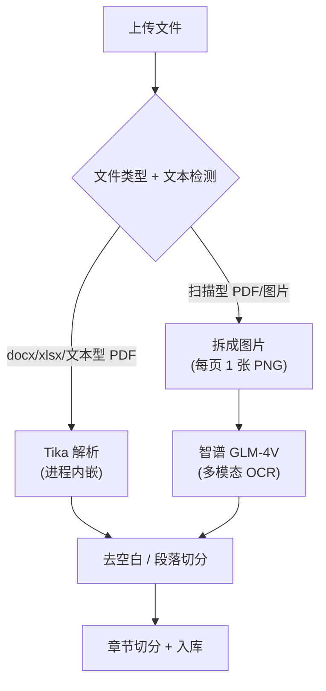
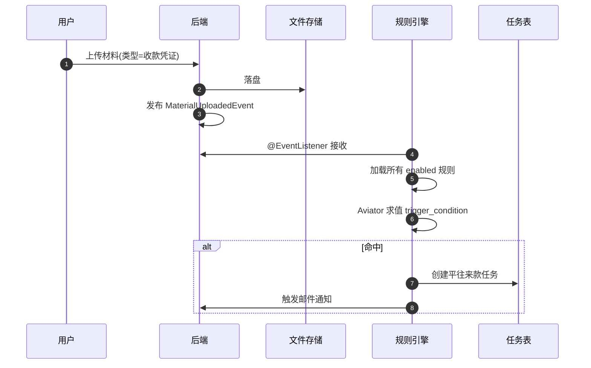

# 投委会档案管理系统 — 精简架构方案 v2(基于你的最终决策)

> 决策基线(2026-06-05)
> - 大模型:智谱 GLM-4-Flash(免费)+ GLM-4V(多模态 OCR,按张计费)
> - 知识库:**不向量化**,MySQL FULLTEXT(倒排索引)+ 章节切分 + 位置定位
> - 脱敏范围:**只脱敏证件号 + 人名**,其他不动
> - 数据库:你现有的 MySQL 8.0.16(8.0+ 内置 ngram 解析器,直接用)
> - 部署:Windows 单机(32GB,CUP 不强),不搞 Docker / K8s / 容器

---

## 0. 一句话架构

**Spring Boot 3 单体 + MySQL 8 FULLTEXT + Apache Tika(docx/xlsx/文本 PDF)+ 智谱 GLM-4-Vision(扫描件 OCR)+ 智谱 GLM-4-Flash(摘要/问答/时点抽取)+ Aviator 规则引擎 + WinSW + Caddy**,全跑在一台 Windows 上,总共 3-4 个进程。

---

## 1. 架构图



**进程清单(就这 4 个)**:

| 进程 | 占用 | 用途 | 服务化 |
|---|---|---|---|
| 后端 JAR | 1.5 GB | Spring Boot 3 + Tika + Aviator | WinSW |
| Caddy | < 100 MB | 反代 + HTTPS | WinSW |
| MySQL 8.0.16 | 2-4 GB | 元数据 + FULLTEXT 索引 | Windows 服务 |
| (无独立 OCR 进程) | - | 调 GLM-4V API 即可 | - |

---

## 2. 技术选型(确认版)

| # | 组件 | 选型 | 备注 |
|---|------|------|------|
| 1 | 前端 | **Vue 3 + Vite + TypeScript + Element Plus** | |
| 2 | 后端 | **Java 17 + Spring Boot 3.3** | |
| 3 | 数据库 | **MySQL 8.0.16**(已有) | 8.0+ 内置 ngram,FULLTEXT 中文无需插件 |
| 4 | 文件存储 | **D:\archive\files**(本地文件夹) | 50GB 没必要上对象存储 |
| 5 | 文档解析(文本型) | **Apache Tika 2.9**(嵌入后端进程) | docx / xlsx / 文本 PDF 99% 准 |
| 6 | 文档解析(扫描件) | **智谱 GLM-4V**(API) | 多模态大模型,直接识图读字,不用 Tesseract |
| 7 | 全文检索 | **MySQL 8 FULLTEXT + ngram 解析器** | 不向量化,纯倒排索引 |
| 8 | 大模型 | **智谱 GLM-4-Flash**(API,免费) | 摘要 / 问答 / 时点抽取 |
| 9 | 任务调度 | **Spring @Scheduled** | 单机够用,不引 XXL-JOB |
| 10 | 消息通知 | **SMTP 邮件** | 内网邮件中继,审计完整 |
| 11 | 规则引擎(5 号需求) | **Aviator 5.x**(Java 表达式,几 MB) | 不上 Drools |
| 12 | 反代/HTTPS | **Caddy 2**(Windows 单 exe) | 自动 HTTPS,可绑内网 CA |
| 13 | 服务化 | **WinSW 3.x** | JAR → Windows 服务 |
| 14 | 脱敏 | **正则 + HanLP/jieba NER** | 证件号(正则)+ 人名(NER) |

**不引入的组件**(明确):
- ❌ Qdrant / Milvus / pgvector(不向量化)
- ❌ OpenSearch / Elasticsearch / Meilisearch(用 MySQL FULLTEXT)
- ❌ MinIO / FastDFS(本地文件夹)
- ❌ Docker / K8s / Rancher Desktop(单进程足够)
- ❌ Tesseract / PaddleOCR / RapidOCR(GLM-4V 替代)
- ❌ XXL-JOB / Quartz / ShedLock 单机版太重
- ❌ Prometheus + Grafana(Windows 性能计数器 + cron 邮件)
- ❌ Ollama / Qwen 本地部署(智谱免费 API)

---

## 3. 知识库方案(全文索引 + 章节定位)

### 3.1 检索流程(无向量化)


### 3.2 MySQL 全文索引(关键 DDL)

```sql
-- 启用 ngram(8.0+ 内置,直接用)
-- 全文索引建在章节摘要表
CREATE TABLE chapter_summary (
  id BIGINT PRIMARY KEY AUTO_INCREMENT,
  material_version_id BIGINT NOT NULL,
  chapter_no INT NOT NULL,
  chapter_title VARCHAR(255),
  content MEDIUMTEXT,            -- 章节原文
  summary TEXT,                   -- LLM 生成的 200 字摘要
  keywords VARCHAR(512),          -- LLM 抽取的关键词,逗号分隔
  page_start INT,
  page_end INT,
  created_at DATETIME,
  FULLTEXT KEY ft_content_summary (content, summary) WITH PARSER ngram,
  KEY idx_material (material_version_id)
) ENGINE=InnoDB DEFAULT CHARSET=utf8mb4;

-- 查询示例
SELECT chapter_title, page_start,
  MATCH(content, summary) AGAINST('合同付款条款 履约保证金' IN BOOLEAN MODE) AS score
FROM chapter_summary
WHERE MATCH(content, summary) AGAINST('合同付款条款 履约保证金' IN BOOLEAN MODE)
ORDER BY score DESC
LIMIT 20;
```

### 3.3 章节切分策略

文档入库时,后端用规则 + LLM 切分:
1. Tika 解析出纯文本 + 页码映射
2. 启发式切分(正则识别"第 N 条"、"##"、"1.1"、"1)"等)
3. 兜底:LLM 二次切分(章节标题识别不准时)
4. 每章节入库,生成 200 字摘要 + 关键词

### 3.4 评估指标(单人开发不重)

- 自己标 **30-50 条**"问题 + 期望答案"(不要 300-500,30 条起步)
- 目标:**top-5 召回率 ≥ 80%**、**答案可用率 ≥ 70%**、**P95 端到端 ≤ 4s**
- 每次 prompt/模型变更重跑

---

## 4. 文档解析 & OCR(多模态方案)

### 4.1 双轨解析



### 4.2 GLM-4V 调用示例

```java
// 伪代码
String ocrScanPage(byte[] pngBytes) {
    String prompt = "请提取这张图片中的所有文字和表格,按原文结构输出。如果是表格,保留行列结构。";
    return glm4v.chat(prompt, pngBytes);  // API 调用
}
```

### 4.3 成本估算

- 50GB 文档,假设 10% 是扫描件 = 5GB
- 扫描 PDF 平均每页 200KB → 约 **5000 张图**
- GLM-4V 价格约 **0.01 元/张**
- **一次性建库 50-100 元**
- 日常新增扫描件每月几十张 → 几块钱
- 几乎可忽略

---

## 5. 脱敏方案(简化版)

### 5.1 脱敏范围(只这两类)

| 类别 | 例子 | 识别方式 | 替换为 |
|---|---|---|---|
| **证件号** | 身份证 18位、护照、银行卡 16-19位 | 正则 | `***` |
| **人名** | 签字人、客户联系人、内部员工 | HanLP/jieba NER(PERSON 实体) | `[姓名1]`、`[姓名2]` |

**项目名 / 客户名 / 金额 / 合同条款 / 制度描述 不脱敏**。

### 5.2 脱敏实现

```java
// 脱敏策略(后端处理)
class Desensitizer {
    // 1. 证件号:正则匹配
    private static final Pattern ID_CARD = Pattern.compile("\\d{17}[\\dXx]|\\d{15}");
    private static final Pattern PASSPORT = Pattern.compile("[A-Z]\\d{8}");
    private static final Pattern BANK_CARD = Pattern.compile("\\d{16,19}");

    // 2. 人名:HanLP NER
    private List<String> extractNames(String text) {
        return HanLP.newSegment().enableNameRecognize(true)
            .seg(text).stream()
            .filter(t -> t.getNature().startsWith("nr"))  // 人名
            .map(Term::getWord)
            .distinct()
            .toList();
    }

    public String desensitize(String text) {
        // 1. 替换证件号
        text = ID_CARD.matcher(text).replaceAll("***");
        text = PASSPORT.matcher(text).replaceAll("***");
        text = BANK_CARD.matcher(text).replaceAll("***");
        // 2. 替换人名(按出现顺序编号)
        AtomicInteger idx = new AtomicInteger(0);
        Map<String, String> map = new HashMap<>();
        for (String name : extractNames(text)) {
            if (!map.containsKey(name)) {
                map.put(name, "[姓名" + idx.incrementAndGet() + "]");
            }
        }
        for (var e : map.entrySet()) {
            text = text.replace(e.getKey(), e.getValue());
        }
        return text;
    }
}
```

### 5.3 映射回填(LLM 答案中)

- 脱敏映射表存 MySQL(`desensitize_map` 表)
- LLM 答案返回时,后端用映射表把 `[姓名1]` 替换回真实名
- 用户看到完整答案,LLM 永远看不到真实人名

---

## 6. 数据模型(精简)

跟 v1 一致,几个关键表:

```sql
-- 项目
CREATE TABLE project (
  id BIGINT PRIMARY KEY AUTO_INCREMENT,
  code VARCHAR(64) UNIQUE NOT NULL,
  name VARCHAR(255) NOT NULL,
  stage VARCHAR(32),    -- 立项/审议/投后/退出
  status VARCHAR(32),   -- 进行中/已结束/已搁置
  owner_id BIGINT,
  amount DECIMAL(18,2),
  created_at DATETIME,
  KEY idx_status (status)
) ENGINE=InnoDB DEFAULT CHARSET=utf8mb4;

-- 议案
CREATE TABLE proposal (
  id BIGINT PRIMARY KEY AUTO_INCREMENT,
  project_id BIGINT NOT NULL,
  meeting_id BIGINT,
  code VARCHAR(64) UNIQUE NOT NULL,
  title VARCHAR(255) NOT NULL,
  status VARCHAR(32),   -- 草稿/已上会/通过/退回/搁置
  summary TEXT,
  decision TEXT,
  submitted_at DATETIME,
  reviewed_at DATETIME,
  KEY idx_project (project_id)
) ENGINE=InnoDB DEFAULT CHARSET=utf8mb4;

-- 材料
CREATE TABLE material (
  id BIGINT PRIMARY KEY AUTO_INCREMENT,
  proposal_id BIGINT NOT NULL,
  name VARCHAR(255) NOT NULL,
  type VARCHAR(32),     -- 尽调/法律/财务/合同/PPT/其他
  is_required TINYINT(1) DEFAULT 0,
  sort_order INT,
  KEY idx_proposal (proposal_id)
) ENGINE=InnoDB DEFAULT CHARSET=utf8mb4;

-- 材料版本(核心)
CREATE TABLE material_version (
  id BIGINT PRIMARY KEY AUTO_INCREMENT,
  material_id BIGINT NOT NULL,
  version_no INT NOT NULL,
  file_path VARCHAR(512) NOT NULL,   -- D:\archive\files\2024\PRJ001-尽调-v1.pdf
  file_size BIGINT,
  file_hash VARCHAR(64),             -- SHA-256,去重
  parse_status VARCHAR(16),          -- 待解析/解析中/成功/失败
  parse_method VARCHAR(16),          -- tika/glmv
  parse_error TEXT,
  content LONGTEXT,                  -- 解析后纯文本(可选,用于全文检索兜底)
  uploader_id BIGINT,
  uploaded_at DATETIME,
  KEY idx_material (material_id),
  UNIQUE KEY uk_material_version (material_id, version_no)
) ENGINE=InnoDB DEFAULT CHARSET=utf8mb4;

-- 章节摘要(知识库核心)
CREATE TABLE chapter_summary (
  id BIGINT PRIMARY KEY AUTO_INCREMENT,
  material_version_id BIGINT NOT NULL,
  chapter_no INT NOT NULL,
  chapter_title VARCHAR(255),
  content MEDIUMTEXT,
  summary TEXT,
  keywords VARCHAR(512),
  page_start INT,
  page_end INT,
  created_at DATETIME,
  FULLTEXT KEY ft_content_summary (content, summary) WITH PARSER ngram,
  KEY idx_material (material_version_id)
) ENGINE=InnoDB DEFAULT CHARSET=utf8mb4;

-- 时点
CREATE TABLE timepoint (
  id BIGINT PRIMARY KEY AUTO_INCREMENT,
  project_id BIGINT NOT NULL,
  material_version_id BIGINT,
  name VARCHAR(255) NOT NULL,
  type VARCHAR(32),       -- 到期/审议/披露/付款/法律意见/工商变更
  due_at DATE,
  reminder_days VARCHAR(64),  -- 逗号分隔:30,7,1,0
  status VARCHAR(16),     -- 待提醒/已提醒/已处理/已逾期/已作废
  source_text TEXT,        -- 原文出处
  source_page INT,
  confidence FLOAT,         -- 抽取置信度
  extracted_by VARCHAR(16),  -- manual/llm
  created_at DATETIME,
  KEY idx_project (project_id),
  KEY idx_due (due_at)
) ENGINE=InnoDB DEFAULT CHARSET=utf8mb4;

-- 任务
CREATE TABLE task (
  id BIGINT PRIMARY KEY AUTO_INCREMENT,
  code VARCHAR(64) UNIQUE NOT NULL,
  name VARCHAR(255) NOT NULL,
  type VARCHAR(32),
  status VARCHAR(16),     -- 待办/进行中/已完成/已取消/已逾期
  priority INT DEFAULT 3,
  owner_id BIGINT,
  related_project_id BIGINT,
  related_proposal_id BIGINT,
  related_rule_id BIGINT,
  payload JSON,            -- 扩展参数
  due_at DATETIME,
  completed_at DATETIME,
  created_at DATETIME,
  KEY idx_owner_status (owner_id, status),
  KEY idx_due (due_at)
) ENGINE=InnoDB DEFAULT CHARSET=utf8mb4;

-- 规则(节点触发)
CREATE TABLE rule (
  id BIGINT PRIMARY KEY AUTO_INCREMENT,
  code VARCHAR(64) UNIQUE NOT NULL,
  name VARCHAR(255) NOT NULL,
  trigger_event VARCHAR(64),       -- material.uploaded / timepoint.approaching
  trigger_condition TEXT,           -- Aviator 表达式
  action_type VARCHAR(32),         -- create_task / send_notification
  action_template JSON,
  enabled TINYINT(1) DEFAULT 1,
  created_at DATETIME
) ENGINE=InnoDB DEFAULT CHARSET=utf8mb4;

-- 问答记录
CREATE TABLE qa_record (
  id BIGINT PRIMARY KEY AUTO_INCREMENT,
  user_id BIGINT,
  question TEXT,
  answer TEXT,
  retrieved_chapter_ids JSON,    -- 命中的章节
  citations JSON,                 -- 引用详情
  llm_model VARCHAR(64),
  latency_ms INT,
  feedback_score INT,             -- 1-5
  created_at DATETIME
) ENGINE=InnoDB DEFAULT CHARSET=utf8mb4;

-- 通知
CREATE TABLE notification (
  id BIGINT PRIMARY KEY AUTO_INCREMENT,
  channel VARCHAR(16),    -- email
  target_user_id BIGINT,
  related_task_id BIGINT,
  related_timepoint_id BIGINT,
  content TEXT,
  status VARCHAR(16),     -- 待发/已发/失败
  retry_count INT DEFAULT 0,
  sent_at DATETIME,
  created_at DATETIME
) ENGINE=InnoDB DEFAULT CHARSET=utf8mb4;

-- 用户
CREATE TABLE user (
  id BIGINT PRIMARY KEY AUTO_INCREMENT,
  username VARCHAR(64) UNIQUE NOT NULL,
  display_name VARCHAR(128),
  password_hash VARCHAR(128),
  email VARCHAR(128),
  role VARCHAR(32),       -- admin/committee/project_owner/employee
  status VARCHAR(16),     -- 在岗/停用
  last_login_at DATETIME,
  created_at DATETIME
) ENGINE=InnoDB DEFAULT CHARSET=utf8mb4;

-- 上会
CREATE TABLE meeting (
  id BIGINT PRIMARY KEY AUTO_INCREMENT,
  code VARCHAR(64) UNIQUE NOT NULL,
  name VARCHAR(255),
  scheduled_at DATETIME,
  location VARCHAR(255),
  status VARCHAR(16),
  agenda TEXT
) ENGINE=InnoDB DEFAULT CHARSET=utf8mb4;

-- 脱敏映射(回填用)
CREATE TABLE desensitize_map (
  id BIGINT PRIMARY KEY AUTO_INCREMENT,
  doc_id BIGINT,            -- 文档/章节
  placeholder VARCHAR(64),  -- [姓名1]
  real_value VARCHAR(255),  -- 真实人名
  created_at DATETIME,
  UNIQUE KEY uk_doc_placeholder (doc_id, placeholder)
) ENGINE=InnoDB DEFAULT CHARSET=utf8mb4;
```

**总 11 张表**,够用,不堆。

---

## 7. 节点触发(5 号需求) —— Aviator 表达式

### 7.1 规则示例:收款凭证 → 平往来款任务

```json
{
  "code": "RECEIPT_AUTO_PINGWANG",
  "name": "收款凭证入库自动生成平往来款任务",
  "trigger_event": "material.uploaded",
  "trigger_condition": "material.type == 'receipt' && material.amount > 0",
  "action_type": "create_task",
  "action_template": {
    "task_name": "平往来款:${material.project_code}",
    "owner_role": "finance",
    "due_days": 3,
    "priority": 3
  },
  "enabled": true
}
```

### 7.2 执行流程



### 7.3 Aviator 表达式语法(示例)

```java
// 表达式:material.type == 'receipt' && material.amount > 0
// 上下文: { material: { type, amount, project_code, ... } }
// 返回值:boolean
AviatorEvaluator evaluator = AviatorEvaluator.newInstance();
Map<String, Object> env = Map.of(
    "material", Map.of("type", "receipt", "amount", 500_000, "project_code", "PRJ001")
);
boolean hit = (boolean) evaluator.execute(rule.getTriggerCondition(), env);
```

---

## 8. 部署(单机原生)

### 8.1 目录结构

```
D:\archive\
├── files\                    # 原始文件
│   └── 2024\PRJ001-001-v1-尽调.pdf
├── parsed\                   # 解析缓存
└── logs\

E:\backup\                    # 每日镜像
├── mysql\
└── files\

D:\apps\
├── jdk-17\
├── backend\
│   ├── archive.jar
│   ├── application.yml
│   └── logs\
├── frontend\                # Vue dist
├── caddy\
│   ├── caddy.exe
│   ├── Caddyfile
│   └── certs\
├── winsw\
│   ├── backend.xml
│   └── caddy.xml
└── scripts\
    ├── backup-mysql.bat
    ├── backup-files.bat
    └── healthcheck.ps1
```

### 8.2 application.yml(关键配置)

```yaml
spring:
  application:
    name: archive
  datasource:
    url: jdbc:mysql://localhost:3306/archive_db?useUnicode=true&characterEncoding=utf8mb4&serverTimezone=Asia/Shanghai
    username: archive_app
    password: ${DB_PASSWORD}
    hikari:
      maximum-pool-size: 10
  servlet:
    multipart:
      max-file-size: 100MB
      max-request-size: 100MB
  mail:
    host: smtp.internal.example.cn
    port: 25
    username: archive@example.com
    password: ${MAIL_PASSWORD}

app:
  file:
    storage-root: D:/archive/files
    parsed-root: D:/archive/parsed
  glm:
    api-key: ${GLM_API_KEY}
    chat-url: https://open.bigmodel.cn/api/paas/v4/chat/completions
    vision-url: https://open.bigmodel.cn/api/paas/v4/vision
    chat-model: glm-4-flash
    vision-model: glm-4v
  desensitize:
    enabled: true
    targets: [id_card, passport, bank_card, person_name]
  backup:
    backup-root: E:/backup
    mysql:
      enabled: true
      host: localhost
      user: backup_operator
      password: ${BACKUP_PASSWORD}
    files:
      enabled: true
      src: D:/archive/files
      dst: E:/backup/files

server:
  port: 8080
  servlet:
    context-path: /

logging:
  level:
    root: INFO
    com.archive: DEBUG
  file:
    name: D:/archive/logs/backend.log
```

### 8.3 WinSW 服务化

**D:\apps\winsw\backend.xml**:
```xml
<service>
  <id>archive-backend</id>
  <name>投委会档案 - 后端</name>
  <executable>java</executable>
  <arguments>-jar -Xms512m -Xmx1536m -Dfile.encoding=UTF-8 -Dconsole.encoding=UTF-8 "D:\apps\backend\archive.jar" --spring.config.location="D:\apps\backend\application.yml"</arguments>
  <workingdirectory>D:\apps\backend</workingdirectory>
  <log mode="roll-by-size">
    <sizeThreshold>10240</sizeThreshold>
    <keepFiles>10</keepFiles>
  </log>
  <onfailure action="restart" delay="30 sec"/>
  <resetfailure>1 hour</resetfailure>
</service>
```

**注册服务**(管理员 PowerShell):
```powershell
cd D:\apps\winsw
.\archive-backend.exe install
.\archive-backend.exe start
# 设置自动启动
Set-Service -Name "archive-backend" -StartupType Automatic
```

Caddy 类似(用 caddy.exe 的服务化命令或 WinSW 包)。

### 8.4 Caddyfile

```caddyfile
# D:\apps\caddy\Caddyfile
:443 {
    encode zstd gzip
    # 前端静态(SPA)
    handle /assets/* {
        root * D:\apps\frontend
        file_server
    }
    handle /* {
        root * D:\apps\frontend
        try_files {path} /index.html
        file_server
    }
    # API 反代
    handle /api/* {
        reverse_proxy localhost:8080 {
            header_up Host {host}
            header_up X-Real-IP {remote_host}
            header_up X-Forwarded-For {remote_host}
            header_up X-Forwarded-Proto {scheme}
        }
    }
}
```

### 8.5 备份脚本(每日计划任务)

**backup-mysql.bat**(每天 02:00):
```bat
@echo off
set ts=%date:~0,4%%date:~5,2%%date:~8,2%
set BACKUP_DIR=E:\backup\mysql
"C:\Program Files\MySQL\MySQL Server 8.0\bin\mysqldump.exe" -u backup_operator -pYOURPASS archive_db | gzip > "%BACKUP_DIR%\backup-%ts%.sql.gz"
forfiles /p "%BACKUP_DIR%" /m *.sql.gz /d -30 /c "cmd /c del @path" 2>nul
```

**backup-files.bat**(每天 03:00):
```bat
robocopy "D:\archive\files" "E:\backup\files" /MIR /Z /R:3 /W:10 /LOG+:"D:\archive\logs\robocopy-%date:~0,4%%date:~5,2%%date:~8,2%.log"
```

**healthcheck.ps1**(每 10 分钟):
```powershell
try {
    $r = Invoke-WebRequest -Uri "http://localhost:8080/actuator/health" -UseBasicParsing -TimeoutSec 5
    if ($r.StatusCode -ne 200) { throw }
} catch {
    Send-MailMessage -To "you@example.com" -From "archive@example.com" `
        -Subject "[Archive] 后端无响应" -Body "请检查服务状态" `
        -SmtpServer "smtp.internal"
}
```

Windows 计划任务把三个脚本串起来。

---

## 9. 实施排期(单人 4-6 周)

| 阶段 | 内容 | 工时 | demo |
|---|---|---|---|
| **M0 基建** | JDK 17 + Spring Boot 3 工程 + Vue 3 工程 + WinSW + Caddy + 用户登录 + 角色权限 | 2-3 天 | 浏览器开 https://localhost 能登录 |
| **M1 档案 CRUD** | project/proposal/material/material_version + 上传下载 + Tika 解析入库 + 章节切分 | 4-5 天 | 上传 PDF → 看到章节入库 |
| **M2 知识库** | FULLTEXT 索引 + LLM 摘要 + LLM 问答(智谱)+ 引用溯源 | 4-5 天 | 问"XX 项目付款条款" → 带引用的答案 |
| **M3 时点** | 手工录入 + LLM 自动抽取(可选)+ 提醒任务 + 邮件 | 2-3 天 | 加时点 → 前 1 天自动收邮件 |
| **M4 规则引擎** | Aviator + 事件订阅 + 任务生成 + 试运行 UI | 3-4 天 | 配"收款凭证 → 平往来款"规则,跑通 |
| **M5 打磨** | 审计日志 + 健康检查 + 备份演练 + 文档 | 2-3 天 | 写好 README,IT 接手能跑 |

**总 17-23 工作日,4-5 周**

---

## 10. 成本估算(几乎为零)

| 项目 | 金额 |
|---|---|
| 服务器(已有) | 0 |
| MySQL(已有) | 0 |
| 智谱 GLM-4-Flash | **0 元**(免费) |
| 智谱 GLM-4V | 一次性建库 50-100 元,日常几元/月 |
| SSL 证书(可选) | 0(自签) |
| 短信(可选) | 几乎不用 |
| **总月成本** | **基本 0 元** |

---

## 11. 风险与简化

| 风险 | 缓解 |
|---|---|
| 智谱服务挂了/限流 | 备用 SiliconFlow(同样免费)或本地缓存常见问答 |
| FULLTEXT 中文不准 | 配合 LLM 重排序;关键词搜 top 20 → LLM 选 top 5 |
| 50GB 文档一次性建库慢 | 异步队列,上传后立即返回,后端慢慢解析 |
| MySQL FULLTEXT 索引膨胀 | 季度优化 `OPTIMIZE TABLE chapter_summary` |
| 你一个人长期被绑死 | 写好文档 + 注释,关键决策点有 README,半年后别人接手能继续 |
| 32GB 内存紧张 | MySQL 限 3GB,JAR 限 1.5GB,留 20GB+ 给 OS |

---

## 12. 我现在可以开始 M0 了

你确认了:
- ✅ 不向量化,MySQL FULLTEXT
- ✅ 智谱 GLM-4-Flash + GLM-4V
- ✅ 只脱敏证件号 + 人名
- ✅ MySQL 8.0.16(完美支持 ngram)

**接下来你需要给我**:

1. **智谱 API key**(或你自己配,告诉我"我自己配"就行)
2. **MySQL 连接信息**(库名/账号/密码),或告诉我"我建好了,库名是 xxx,账号 xxx 密码 xxx"
3. **内网邮件 SMTP 信息**(主机/账号/密码),或"先不发邮件,这一项跳过"

**或者你说"开始 M0"**,我就按 M0 基建的范围开始干——建好工程脚手架,写好 user/role/登录,跑通 WinSW + Caddy,你打开浏览器能看到登录页,登录后看到一个空框架。

预计 M0 完工时间:**2-3 个工作日**(我在云端写代码,写完把代码包和 README 发你,你在你机器上部署即可)。

你定。
