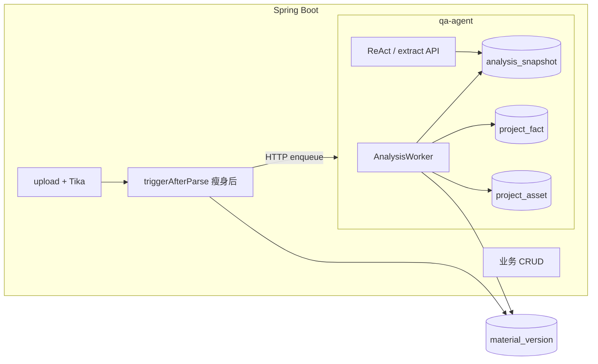

# 深度分析职责迁移 — Java 入库 vs qa-agent Worker

> **版本**: v1.0 (2026-06-15)  
> **决策**: 材料 **Tika 解析 + 轻量落库** 留 Java；**LLM 深度分析 + 结构化落库**（snapshot / fact / asset / timepoint）统一迁 qa-agent `AnalysisWorker`。  
> **关联**: [`08-qa-agent-python-service.md`](08-qa-agent-python-service.md) · [`qa-agent/desc/06-后台深度分析框架.md`](../../qa-agent/desc/06-后台深度分析框架.md)

---

## 1. 为什么要改

| 现状问题 | 目标 |
|---|---|
| `MaterialVersionService.triggerAfterParse()` 同步链路上挂 `ExtractionEngine` + `TimepointExtractor`，改 prompt/模板要发 Java 包 | 分析逻辑全在 Python，独立重启 qa-agent |
| Java / Python 各有一套抽取，结果口径不一致 | 单一写入方：qa-agent Worker |
| 问答每次全文检索 + LLM，慢且贵 | 后台预分析 → Agent 直读 `analysis_snapshot` / `project_fact` |
| 入库阻塞 LLM（虽 @Async 仍占 Java 线程池） | 入库只写 `parsed_text`；分析走队列 |

**不变**: MySQL 单库 · JWT/Java BFF · Tika 仍在 Java · 业务表单 CRUD 仍在 Java。

---

## 2. 目标拓扑

```text
浏览器 ──► Java BFF :8080
              │
              ├─ 档案 CRUD / RBAC / 审计 / Tika parse
              │     MaterialVersionService.parseVersion()
              │       → material_version.parsed_text
              │       → (cutover 后) QaAgentClient.enqueueAnalysis()
              │
              └─ QaAgentClient ──HTTP──► qa-agent :8001
                                            │
                    ┌───────────────────────┼───────────────────────┐
                    │                       │                       │
              POST /v1/ask            AnalysisWorker           POST /v1/extract/*
              ReAct 工具链            轮询 analysis_job          立项轻量预填(可选)
                    │                       │
                    └─────────── MySQL archive_db ────────────────┘
```



---

## 3. 职责切分（目标态）

| 能力 | 负责方 | 写入表 | 说明 |
|---|---|---|---|
| 文件上传、SHA-256、Tika | **Java** | `material_version` | 同步路径，必须可靠 |
| 材料分类事件、剩余金额更新 | **Java** | `project` | `TriggerEngine` + 收款/付款凭证规则保留 |
| 立项表单 **轻量预填** | **qa-agent** `/v1/extract/project-fields` | 无（返回 DTO） | 前台一次性；非深度分析 |
| 项目/资产 **深度 LLM 分析** | **qa-agent Worker** | `analysis_snapshot` · `project_asset` · `project_fact` | 模板驱动，可扩展 |
| 时点抽取 | **qa-agent Worker**（cutover 后） | `timepoint` | 替代 Java `TimepointExtractor` |
| 字段抽取引擎 | **退役**（cutover 后） | — | Java `ExtractionEngine` 默认关闭 |
| 智能问答 | **qa-agent** ReAct | `spring_ai_chat_memory` · 读 snapshot/fact | 优先 `get_project_analysis` 工具 |

---

## 4. 数据模型（分析框架）

> 可执行 SQL：[`deploy/sql/migrate_260615_analysis_framework.sql`](../../deploy/sql/migrate_260615_analysis_framework.sql)（或 bundle `migrate_260615_qa_agent_bundle.sql`）

| 表 | 用途 |
|---|---|
| `analysis_template` | LLM 模板（prompt + output_schema）；运营可 INSERT 扩展 |
| `analysis_job` | 任务队列 pending → running → success/failed |
| `analysis_snapshot` | 结构化结果 + `summary_text`（Agent 直读） |
| `project_asset` | 债权等底层资产实体 |
| `project_analysis_state` | 项目级进度 + 材料指纹 |

**与既有表关系**: `analysis_snapshot.project_id` → `project`；Worker 可选同步到 `project_fact` / `timepoint`（见 `qa-agent/app/analysis/mapper.py`）。

字段清单待同步 [`DATABASE.md`](DATABASE.md) §分析框架（Coder 脚手架 plan 验收项）。

---

## 5. 入库 → 分析触发（cutover 设计）

### 5.1 现状（cutover 前）

```java
triggerAfterParse() {
  extractionEngine.extract();      // ← 移除
  timepointExtractor.extract();    // ← 移除
  publish MaterialCategorizedEvent; // 保留
  updateRemainingAmount();         // 保留
}
```

### 5.2 目标（cutover 后）

```java
triggerAfterParse() {
  if (qaAgentProperties.isAnalysisEnqueueEnabled()) {
    qaAgentClient.enqueueAnalysis(projectId, materialVersionId, "new_material");
  }
  publish MaterialCategorizedEvent;
  updateRemainingAmount;
}
```

**qa-agent 侧**:

1. `POST /v1/analysis/enqueue` 入队（已存在）
2. Worker `discover_and_enqueue`：材料指纹变化 → 自动补 job
3. 按模板顺序：`project.credit_inventory` → 建 `project_asset` → 逐 asset 跑 `asset.credit_profile` → 项目层模板 → `sync_facts_from_snapshots`

**失败策略**: `analysis_job` 幂等重试（`max_attempts=3`）；失败写 `project_analysis_state.last_error`；**不阻塞**入库 HTTP 响应。

---

## 6. 问答读路径（cutover 后）

| 问题类型 | 优先数据源 | 工具 |
|---|---|---|
| 利率/交易结构/核心资产 | `analysis_snapshot` / `project_fact` | `get_project_analysis`（新增） |
| 材料份数/待办 | SQL 聚合 | `get_project_business_data` |
| 全文定位 | FULLTEXT | `search_fulltext` |
| 议案次数/列表 | `proposal` + **业务语义过滤** | 见 [`plan-2026-06-15-proposal-semantics`](../../upgrade_to_settle/plan-2026-06-15-proposal-semantics.md) |

ReAct prompt 应引导：**先 snapshot，后全文**，降低 token 与延迟。

---

## 7. 配置（`config.json`）

```json
"qaAgent": {
  "host": "127.0.0.1",
  "port": 8001,
  "maxIterations": 5,
  "analysisWorker": {
    "enabled": true,
    "pollIntervalSeconds": 30,
    "discoverBatch": 3
  },
  "analysisEnqueue": {
    "enabled": false
  }
}
```

| 开关 | 阶段 | 含义 |
|---|---|---|
| `analysisWorker.enabled` | 脚手架 | Worker 进程内轮询 |
| `analysisEnqueue.enabled` | cutover | Java parse 完成后 HTTP 入队 |

脚手架期：`analysisEnqueue=false`，可手工 `POST /v1/analysis/enqueue` 或 `run-once` 验证。cutover 期：Java 打开 enqueue，关闭 `ExtractionEngine` 调用。

---

## 8. 实施分期（upgrade plan）

| 顺序 | Plan | complexity | 交付 |
|:---:|---|---|---|
| 1 | [`plan-2026-06-15-analysis-framework-scaffold`](../../upgrade_to_settle/plan-2026-06-15-analysis-framework-scaffold.md) | C-0615-02 | SQL + Worker 验收 + `get_project_analysis` 工具 + config 示例 |
| 2 | [`plan-2026-06-15-analysis-ownership-cutover`](../../upgrade_to_settle/plan-2026-06-15-analysis-ownership-cutover.md) | C-0615-03 | Java 瘦身 + enqueue + timepoint 迁移 + 125 联调 |
| 3 | [`plan-2026-06-15-proposal-semantics`](../../upgrade_to_settle/plan-2026-06-15-proposal-semantics.md) | C-0615-01 | 议案 vs 维护语义 + 双端工具对齐 |

**依赖**: 2 依赖 1 在目标环境跑通迁移 SQL 且 Worker 能写出 snapshot。

---

## 9. Java 引擎退役范围

| 组件 | cutover 后 |
|---|---|
| `ExtractionEngine` | `@ConditionalOnProperty` 默认 **off**；仅降级保留 |
| `TimepointExtractor` | 同上；Worker 写入 `timepoint` |
| `ComparisonEngine` | **保留** Java（议案对比，非材料入库链） |
| `TriggerEngine` | **保留** Java |
| `GlmService`（非 Agent） | **保留**（摘要、对比等 Java 业务） |

---

*维护：分析职责变更时同步本文 + `08` + `qa-agent/desc/06` + `DATABASE.md`。*
