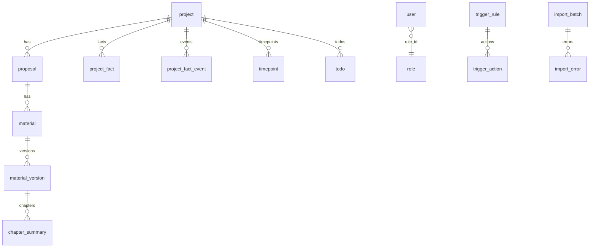

# 数据库库表架构 — Agent 首读

> **唯一真相源（可执行 SQL）**：[`deploy/sql/init.sql`](../../deploy/sql/init.sql)（新库）· [`deploy/sql/migrate_260611_01.sql`](../../deploy/sql/migrate_260611_01.sql)（已有库升级）  
> **版本**：Plan I + v1.1 MOD-01（2026-06-11）· MySQL 8.0+ · 库名 `archive_db` · `utf8mb4_unicode_ci`  
> **本文**：Agent / Coder **查表名、字段名、关系、索引** 用；加字段前先对 `init.sql`，再改 JPA + 本文。

**其它文档（勿当字段真相源）**：

| 文件 | 用途 |
|---|---|
| [`DB-SCHEMA-v2.md`](DB-SCHEMA-v2.md) | v2 迁移脚本、种子数据、历史 ALTER |
| [`04-database-schema.md`](04-database-schema.md) | 分章 ER 说明（**部分列名已过时**，以本文为准） |
| [`deploy/sql/README.md`](../../deploy/sql/README.md) | 何时跑 `init.sql` vs `migrate_260611_01.sql` |

---

## 1. 总览

**表数量：28 张基线 + 5 张分析框架**（2026-06-15，见 [`migrate_260615_analysis_framework.sql`](../../deploy/sql/migrate_260615_analysis_framework.sql)）

| 分组 | 表 | Agent 常见场景 |
|---|---|---|
| 权限 | `role`, `user`, `user_role` | 登录、RBAC |
| 档案链 | `project` → `proposal` → `material` → `material_version` | CRUD、上传、全文检索 |
| 项目协作 | `project_member` | 项目成员 |
| 智能问答 | `spring_ai_chat_memory`, `llm_call_log` | 多轮 QA、LLM 埋点 |
| **后台分析** | `analysis_template`, `analysis_job`, `analysis_snapshot`, `project_asset`, `project_analysis_state` | Worker 深度分析、Agent 直读 snapshot（见 [`09-analysis-ownership-python.md`](09-analysis-ownership-python.md)） |
| 章节/时点 | `chapter_summary`, `timepoint`, `todo` | 摘要、待办 |
| 关键事实 | `project_fact`, `project_fact_event` | 单项目分析、事件流（**event 不可 UPDATE 核心字段**） |
| 规则引擎 | `trigger_rule`, `trigger_action`, `extraction_method`, `comparison_method` | 触发、抽取、对比 |
| 字典/术语 | `dict_type`, `dict_item`, `business_term` | 下拉、网络查源配置 |
| 编号 | `proposal_series` | 议案编号序列 |
| 运维 | `audit_log`, `failure_log`, `notification`, `import_batch`, `import_error` | 审计、通知、导入 |

---

## 2. 核心关系（档案链）

```text
user ──role_id──► role          user_role (user_id, role_id) 多对多扩展

project (1) ──► (N) proposal (1) ──► (N) material (1) ──► (N) material_version
   │                    │
   └── project_member   └── proposal_series（编号序列，非 FK）

project (1) ──► (N) project_fact / project_fact_event / timepoint / todo
material_version (1) ──► (N) chapter_summary
```



---

## 3. FULLTEXT 索引（QA / Agent 必知）

| 表 | 索引名 | 列 | 用途 |
|---|---|---|---|
| `project` | `ft_name_cust` | `name`, `customer_name` | `find_project` 语义/全文 |
| `material_version` | `ft_parsed_text` | `parsed_text` | `search_fulltext`、立项抽取 |
| `chapter_summary` | `ft_content_summary` | `content`, `summary` | 章节检索 |

均使用 **`WITH PARSER ngram`**（MySQL 8 中文分词）。

---

## 4. Agent `query_mysql` 表白名单

Java / Python qa-agent **仅允许**查询以下 6 表（见 `QueryMysqlTool` / `query_mysql.py`）：

`project` · `proposal` · `material` · `material_version` · `todo` · `project_fact`

**禁止** Agent 直写；业务写操作走 Java Service。

---

## 5. 表清单（字段级）

> 列类型摘自 `init.sql`；`?` 表示可 NULL；未列出的审计列见各表 `created_at` / `updated_at` / `created_by` / `updated_by`。

### 5.1 `role` — 角色

| 列 | 类型 | 说明 |
|---|---|---|
| id | BIGINT PK AI | |
| code | VARCHAR(64) UNIQUE | admin/pm/legal/committee/secretary/user |
| name | VARCHAR(128) | 显示名 |
| description | VARCHAR(512) | |
| permissions | JSON | 权限数组 |

### 5.2 `user` — 用户

| 列 | 类型 | 说明 |
|---|---|---|
| id | BIGINT PK AI | |
| username | VARCHAR(64) UNIQUE | 登录名 |
| display_name | VARCHAR(128) | |
| password_hash | VARCHAR(128) | BCrypt |
| email | VARCHAR(128) | |
| role_id | BIGINT FK→role.id | 主角色（v1.1 另有 user_role） |
| department | VARCHAR(128) | |
| status | VARCHAR(16) | 在岗/停用 |
| last_login_at | DATETIME | |
| deleted_at / deleted_by | | 软删 |
| version | INT | 乐观锁 |
| sensitive_view_enabled | TINYINT(1) | 脱敏原始值查看 |

### 5.3 `user_role` — 用户角色多对多（v1.1）

| 列 | 类型 | 说明 |
|---|---|---|
| user_id | BIGINT PK FK→user | |
| role_id | BIGINT PK FK→role | |
| assigned_at | DATETIME | |

### 5.4 `project` — 项目

| 列 | 类型 | 说明 |
|---|---|---|
| id | BIGINT PK AI | |
| code | VARCHAR(64) UNIQUE | 如 PRJ-2026-001 |
| name | VARCHAR(256) | |
| customer_name | VARCHAR(256) | FindProject / FULLTEXT |
| category | VARCHAR(64) | 股权类/固收类/… |
| owner_id | BIGINT | 项目经理 user.id |
| amount_wan | BIGINT | **万元**整数 |
| summary | VARCHAR(2000) | |
| status | VARCHAR(32) | 草稿/待审议/审议中/通过/… |
| scheduled_meeting_at | DATE | |
| remark | VARCHAR(2000) | |
| deleted_at / deleted_by | | 软删 |
| version | INT | 乐观锁 |
| archive_status | VARCHAR(32) | 归档状态 |

### 5.5 `proposal` — 议案

| 列 | 类型 | 说明 |
|---|---|---|
| id | BIGINT PK AI | |
| code | VARCHAR(64) UNIQUE | |
| title | VARCHAR(256) | |
| project_id | BIGINT FK→project | |
| type | VARCHAR(32) | 立项/申请/… |
| summary | VARCHAR(2000) | |
| status | VARCHAR(32) | |
| reviewed_at | DATE | |
| decision | VARCHAR(2000) | 审议结论 |
| condition_text | TEXT | 附条件说明 |
| condition_status | VARCHAR(16) | NONE/PENDING/MET/UNMET |
| condition_met_at | DATETIME | |
| reserved_at / released_at | DATETIME | 编号预留 |
| deleted_at / deleted_by | | 软删 |
| version | INT | |

### 5.6 `material` — 材料

| 列 | 类型 | 说明 |
|---|---|---|
| id | BIGINT PK AI | |
| proposal_id | BIGINT FK→proposal | |
| title | VARCHAR(256) | |
| category | VARCHAR(64) | 尽调报告/法律意见/… |
| current_version_id | BIGINT | 当前版本 |
| status | VARCHAR(32) | |
| description | VARCHAR(1000) | |
| tags | VARCHAR(500) | 逗号分隔 |
| deleted_at / deleted_by | | 软删 |
| version | INT | |
| archived_at | DATETIME | |

### 5.7 `material_version` — 材料版本 ★ QA 核心

| 列 | 类型 | 说明 |
|---|---|---|
| id | BIGINT PK AI | extract-preview / archive_fs 入口 |
| material_id | BIGINT FK→material | |
| version_no | INT | UK(material_id, version_no) |
| original_filename | VARCHAR(256) | |
| storage_path | VARCHAR(1024) | 相对 **file-root** |
| parsed_text_path | VARCHAR(1024) | 相对 **parsed-root** |
| file_size | BIGINT | |
| mime_type | VARCHAR(128) | |
| sha256 | VARCHAR(64) | 同材料去重 |
| parse_status | VARCHAR(16) | pending/running/success/failed |
| parsed_text | LONGTEXT | Tika 全文 + **FULLTEXT** |
| parsed_at | DATETIME | |
| parse_error | VARCHAR(2000) | |
| uploaded_by | VARCHAR(64) | |
| change_note | VARCHAR(1000) | |

### 5.8 `spring_ai_chat_memory` — 多轮对话

| 列 | 类型 | 说明 |
|---|---|---|
| id | BIGINT PK AI | |
| conversation_id | VARCHAR(64) | 前端 sessionId |
| content | TEXT | |
| type | VARCHAR(16) | user/assistant/system/tool |
| timestamp | TIMESTAMP | |

### 5.9 `llm_call_log` — LLM 调用日志

| 列 | 类型 | 说明 |
|---|---|---|
| id | BIGINT PK AI | |
| username | VARCHAR(64) | |
| scenario | VARCHAR(32) | QA/RERANK/EXTRACT/… |
| model | VARCHAR(64) | |
| duration_ms | INT | |
| status | VARCHAR(16) | SUCCESS/FAILED |
| error_message | VARCHAR(500) | |
| prompt_tokens / completion_tokens | INT | 可 NULL |

### 5.10 `chapter_summary` — 章节摘要

| 列 | 类型 | 说明 |
|---|---|---|
| id | BIGINT PK AI | |
| material_version_id | BIGINT FK | |
| chapter_no | INT | |
| chapter_title | VARCHAR(512) | |
| content / summary | MEDIUMTEXT/TEXT | FULLTEXT |
| keywords | VARCHAR(512) | |
| page_start / page_end | INT | |

### 5.11 `timepoint` — 时点

| 列 | 类型 | 说明 |
|---|---|---|
| id | BIGINT PK AI | |
| project_id | BIGINT FK | |
| material_version_id | BIGINT FK | 可 NULL |
| name | VARCHAR(255) | |
| type | VARCHAR(32) | |
| due_at | DATE | |
| status | VARCHAR(16) | 待提醒/… |
| confidence | DECIMAL(3,2) | |
| extracted_by | VARCHAR(16) | manual/llm |

### 5.12 `todo` — 待办

| 列 | 类型 | 说明 |
|---|---|---|
| id | BIGINT PK AI | |
| title | VARCHAR(255) | |
| source | VARCHAR(16) | TIMEOUT/MANUAL/TRIGGER |
| source_ref_id | BIGINT | |
| project_id | BIGINT FK | |
| owner_id | BIGINT FK→user | |
| priority | VARCHAR(16) | |
| status | VARCHAR(16) | pending/… |
| due_at / completed_at | DATETIME | |

### 5.13 `project_fact` — 关键事实（当前态）

| 列 | 类型 | 说明 |
|---|---|---|
| id | BIGINT PK AI | |
| project_id | BIGINT FK | |
| fact_type | VARCHAR(64) | mortgage/guarantor/… |
| fact_value | TEXT | |
| confidence | DECIMAL(3,2) | |
| confidence_level | VARCHAR(16) | CONFIRMED/AI_INFERRED/PENDING_REVIEW |
| evidence_material_id | BIGINT | |
| evidence_snippet | TEXT | |
| status | VARCHAR(32) | active/… |

### 5.14 `project_fact_event` — 事实事件流 ★ 只 INSERT

| 列 | 类型 | 说明 |
|---|---|---|
| id | BIGINT PK AI | |
| project_id | BIGINT FK | |
| fact_type | VARCHAR(64) | |
| event_type | VARCHAR(32) | INSERT/UPDATE/DELETE/ROLLBACK |
| fact_value / evidence | TEXT | |
| confidence / confidence_level | | |
| owner_id / due_date / resolved_at | | 跟进 |
| created_by | BIGINT | |
| deleted_at / deleted_by | | 逻辑标记；**触发器禁止改核心列** |

> DB 触发器 `trg_fact_event_immutable` / `trg_fact_event_no_delete` — H2 单测不覆盖，125 MySQL 必测。

### 5.15 `business_term` — 业务术语

| 列 | 类型 | 说明 |
|---|---|---|
| id | BIGINT PK AI | |
| name | VARCHAR(128) | |
| english_name | VARCHAR(128) | |
| aliases | VARCHAR(512) | |
| category | VARCHAR(64) | |
| definition / standard_definition | TEXT | |
| source_url | VARCHAR(512) | |
| data_mapping | JSON | |
| status | VARCHAR(32) | draft/active/… |
| deleted_at / deleted_by | | 软删 |

### 5.16 `dict_type` / `dict_item` — 系统字典

- **dict_type**：`type_code` UNIQUE，`type_name`，`is_system`，`enabled`
- **dict_item**：`(type_code, item_key)` UNIQUE → `item_value`（含 network_dict_source JSON 配置）

### 5.17 `trigger_rule` / `trigger_action`

- **trigger_rule**：`code` UNIQUE，`trigger_event`，`trigger_condition`，`enabled`，`builtin`
- **trigger_action**：`rule_id` FK，`action_type`，`action_template` JSON

### 5.18 `extraction_method` / `comparison_method`

- 预置 `DEFAULT_PROJECT_FIELDS` 等；`prompt_template` + `output_schema` JSON
- 立项 `extract-preview` 用 extraction_method

### 5.19 `proposal_series` — 编号序列

| 列 | 类型 | 说明 |
|---|---|---|
| code | VARCHAR(64) UNIQUE | 系列编码 |
| prefix | VARCHAR(32) | |
| current_seq | INT | 自增序号 |

### 5.20 `project_member` — 项目成员

| 列 | 类型 | 说明 |
|---|---|---|
| project_id | BIGINT PK FK | |
| user_id | BIGINT PK FK | |
| role_in_project | VARCHAR(64) | member/owner/legal |

### 5.21 `audit_log` — 审计

| 列 | 类型 | 说明 |
|---|---|---|
| actor | VARCHAR(64) | |
| action | VARCHAR(64) | |
| type | VARCHAR(32) | WRITE/LOGIN/SENSITIVE_VIEW/EXPORT/LLM |
| entity_type / entity_id | | |
| old_value / new_value | JSON | |
| ip_address / user_agent / request_id | | |

### 5.22 `failure_log` / `notification` / `import_batch` / `import_error`

- **failure_log**：API/LLM 失败兜底，`path`，`failure_type`，`resolved`
- **notification**：`user_id`，`type`，`is_read`，`link`
- **import_batch** → **import_error**：批量导入行级错误

---

## 6. 常用 JOIN（复制即用）

**材料全文检索结果（与 Java SearchResult 对齐）**：

```sql
SELECT mv.id AS versionId, mv.material_id AS materialId, m.title AS materialTitle,
       mv.version_no AS versionNo, mv.original_filename AS originalFilename,
       p.code AS projectCode, p.name AS projectName,
       pr.code AS proposalCode, pr.title AS proposalTitle,
       SUBSTRING(mv.parsed_text, 1, 300) AS snippet,
       MATCH(mv.parsed_text) AGAINST (? IN NATURAL LANGUAGE MODE) AS score
FROM material_version mv
JOIN material m ON m.id = mv.material_id
JOIN proposal pr ON pr.id = m.proposal_id
JOIN project p ON p.id = pr.project_id
WHERE mv.parsed_text IS NOT NULL
  AND MATCH(mv.parsed_text) AGAINST (? IN NATURAL LANGUAGE MODE)
ORDER BY score DESC LIMIT ?;
```

**项目定位（find_project）**：

```sql
SELECT id, code, name, status, amount_wan
FROM project
WHERE deleted_at IS NULL
  AND (code = ? OR MATCH(name, customer_name) AGAINST (? IN NATURAL LANGUAGE MODE)
       OR name LIKE ? OR code LIKE ?)
ORDER BY score DESC LIMIT ?;
```

---

## 7. 维护约定（Agent 加表/加字段）

1. 改 [`deploy/sql/init.sql`](../../deploy/sql/init.sql)（新环境一键建库）
2. 改 [`deploy/sql/migrate_260611_01.sql`](../../deploy/sql/migrate_260611_01.sql) 或追加新的 `deploy/sql/migrate_*.sql`（已有库增量）
3. 更新 **本文** §3～§5 + 对应 JPA Entity
4. 若影响 Agent：更新 `query_mysql` 白名单 / qa-agent 工具 / `AgentSystemPrompt`
5. 可选：在 [`DB-SCHEMA-v2.md`](DB-SCHEMA-v2.md) 附录记迁移摘要

---

*维护：库结构变更时同步 `init.sql` + 本文件。疑问以 `init.sql` 为准。*
